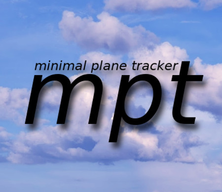
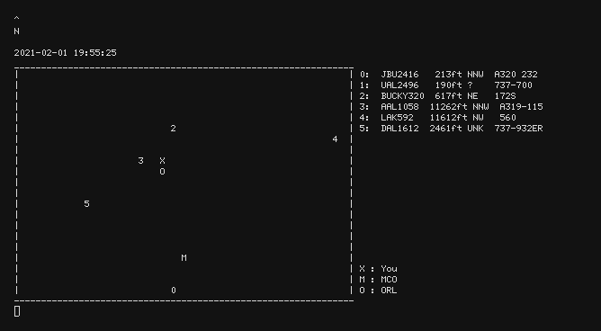

##### usage

`python mpt.py [-u openskyusername -p openskypassword -x longitude_start longitude_end -y lattitude_start lattitude_end -s your_lattitude your_longitude --width width --height height]`

An OpenSky account is *not* needed, but having one will improve the update rate from 10 seconds to 5 seconds.

The -x, -y and -s arguments are all optional. By default, mpt will display planes in the area of (28.386568,28.671913),(-81.506882,-81.112747).

--width and --height are optional, and have the default values of 60 and 20.

-s lets you set a marker where you happen to be located. You will be displayed as an X on the map.

You can set up a set of airports to monitor by adjusting the `airports` variable in `airports.py`.

##### dependencies

* opensky_api
